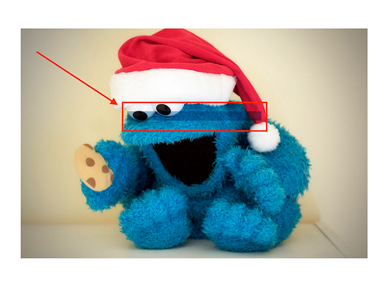
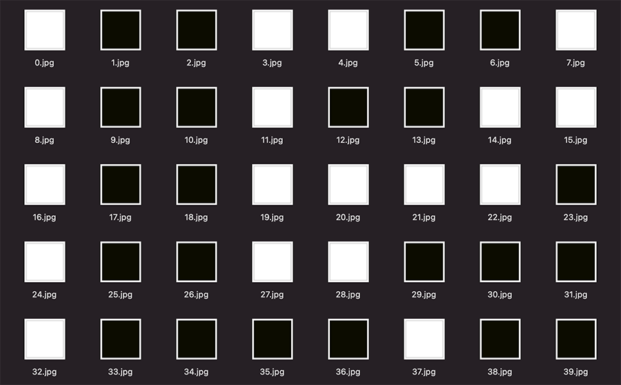
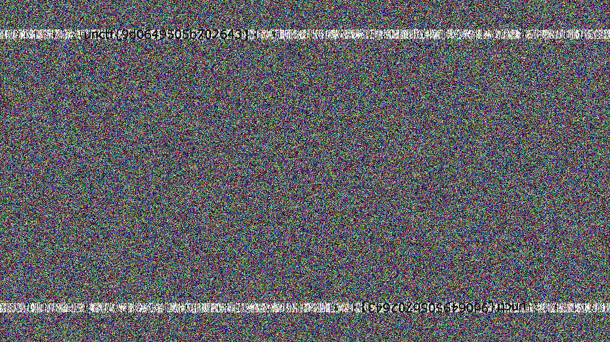

## Exercise area

### this_is_flag

#### 思路

题目描述即为flag

#### flag

```text
flag{th1s_!s_a_d4m0_4la9}
```

### pdf

#### 思路

附件为pdf，全选后，图片后有一个文本杠，复制到记事本，得到flag



#### flag

```text
flag{security_through_obscurity}
```

### give_you_flag

#### 思路

附件为gif图片，解开图片序列后，有一张缺了定位块的二维码，补全后扫码得flag


#### flag

```text
flag{e7d478cf6b915f50ab1277f78502a2c5}
```

### 坚持60s

#### 思路

jadx-gui打开jar包，在PlaneGameFrame类中，找到下面信息，base64解码后得flag

```java
public class PlaneGameFrame extends MyFrame {
    public void paint(Graphics g) {
        if (!this.p.isLive()) {
        printInfo(g, "兄弟就死了的嘛", 50, 150, 200);
        int period = (int) ((this.endTime.getTime() - this.startTime.getTime()) / 1000);
        printInfo(g, "你的持久度才" + period + "秒", 50, 150, 250);
        switch (period / 10) {
            case 0:
                printInfo(g, "真.头顶一片青青草原", 50, 150, 300);
                return;
            case 1:
                printInfo(g, "这东西你也要抢着带？", 50, 150, 300);
                return;
            case 2:
                printInfo(g, "如果梦想有颜色，那一定是原谅色", 40, 30, 300);
                return;
            case 3:
                printInfo(g, "哟，炊事班长呀兄弟", 50, 150, 300);
                return;
            case 4:
                printInfo(g, "加油你就是下一个老王", 50, 150, 300);
                return;
            case 5:
                printInfo(g, "如果撑过一分钟我岂不是很没面子", 40, 30, 300);
                return;
            case 6:
                printInfo(g, "flag{RGFqaURhbGlfSmlud2FuQ2hpamk=}", 50, 150, 300);
                return;
            default:
                return;
        }
    }
```
#### flag

```text
flag{DajiDali_JinwanChiji}
```

### gif

#### 思路

附件zip解压后，得到图片序列。白为0，黑为1, 转成二进制，得flag



```text
01100110011011000110000101100111011110110100011001110101010011100101111101100111011010010100011001111101
```

#### flag

```text
flag{FuN_giF}
```

#### 参考链接

[http://tool.huixiang360.com/str/from-binary.php](http://tool.huixiang360.com/str/from-binary.php)

### 掀桌子

#### 思路

按题目掀桌子的意思，就是反过来。而数据都是大于128的，所以将符号位去掉后，得flag。

```python
#!/usr/bin/env python3

hex_str = 'c8e9aca0c6f2e5f3e8c4efe7a1a0d4e8e5a0e6ece1e7a0e9f3baa0e8eafae3f9e4eafae2eae4e3eaebfaebe3f5e7e9f3e4e3e8eaf9eaf3e2e4e6f2'

print(''.join([chr(int(hex_str[i:i+2], 16)&0x7f) for i in range(0, len(hex_str), 2)]))
```

#### flag

```text
flag{hjzcydjzbjdcjkzkcugisdchjyjsbdfr}
```

### 如来十三掌

#### 思路

通过与佛论禅编码解码

```text
MzkuM3gvMUAwnzuvn3cgozMlMTuvqzAenJchMUAeqzWenzEmLJW9
```

ROT-13编码解码，然后base64解码得flag

```text
ZmxhZ3tiZHNjamhia3ptbmZyZGhidmNraWpuZHNrdmJramRzYWJ9
```

#### flag

```text
flag{bdscjhbkzmnfrdhbvckijndskvbkjdsab}
```

#### 参考链接

[http://www.keyfc.net/bbs/tools/tudoucode.aspx](http://www.keyfc.net/bbs/tools/tudoucode.aspx)

### stegano

#### 思路

用WPS打开，全选，会发现AB的文本，转成摩斯密码。

```text
BABA BBB BA BBA ABA AB B AAB ABAA AB B AA BBB BA AAA BBAABB AABA ABAA AB BBA BBBAAA ABBBB BA AAAB ABBBB AAAAA ABBBB BAAA ABAA AAABB BB AAABB AAAAA AAAAA AAAAB BBA AAABB
```

`A`换成`.`, `B`转成`-`，得摩斯密码。

```text
-.-. --- -. --. .-. .- - ..- .-.. .- - .. --- -. ... --..-- ..-. .-.. .- --. ---... .---- -. ...- .---- ..... .---- -... .-.. ...-- -- ...-- ..... ..... ....- --. ...--
```

解密后的flag信息

```
CONGRATULATIONSFLAG1NV151BL3M3554G3
```

```bash
echo flag{1NV151BL3M3554G3} | tr A-Z a-z
```

#### flag

```text
flag{1nv151bl3m3554g3}
```

### SimpleRAR

#### 思路

二进制查看文件，发现有两个文件，第二个文件的头有损坏，0x53处的0x7a改为0x74修复后解压，得到一个文件文件flag.txt和一张图片secret.png。

```text
00000000: 5261 7221 1a07 00cf 9073 0000 0d00 0000  Rar!.....s......
00000010: 0000 0000 d556 7420 902d 0010 0000 0010  .....Vt .-......
00000020: 0000 0002 c788 6736 6dbb 4e4b 1d30 0800  ......g6m.NK.0..
00000030: 2000 0000 666c 6167 2e74 7874 00b0 5700   ...flag.txt..W.
00000040: 4366 6c61 6720 6973 206e 6f74 2068 6572  Cflag is not her
00000050: 65a8 3c74 2090 2f00 3a15 0000 4216 0000  e.<t ./.:...B...
00000060: 02bc e98c 2f6e 844f 4b1d 330a 0020 0000  ..../n.OK.3.. ..
00000070: 0073 6563 7265 742e 706e 6700 f040 ab18  .secret.png..@..
00000080: 11c1 1155 08d1 5580 0d99 c490 8793 2219  ...U..U.......".
```

flat.txt中没有发现flag，而binwalk发现secret.png不是png，而是gif文件，有两个图层，导出后得到两个空白图片，用stegsolve查看，分别发现一个二维码的上下。


修复后，得flag


#### flag

```text
flag{yanji4n_bu_we1shi}
```

### base64stego

#### 思路

base64隐写

```python
#!/usr/bin/env python3
# -*- coding: utf-8 -*-

import base64

base64str = 'ABCDEFGHIJKLMNOPQRSTUVWXYZabcdefghijklmnopqrstuvwxyz0123456789+/'
bin_str = ''
with open("stego.txt", "r") as fin:
    lines = fin.readlines()
for line in lines:
    line = line.strip()
    pad_len = line.count("=")
    line = line.replace("=", "")
    if pad_len > 0:
        b64idx = base64str.index(line[-1])
        bin_str += '{0:06b}'.format(b64idx)[-pad_len*2:]

#bin2int = lambda x:[int(bin_str[i:i+8],2) for i in range(0, len(bin_str), 8)]

print(''.join([chr(int(bin_str[i:i+8],2)) for i in range(0,len(bin_str),8)]))
```

#### flag

```text
flag{Base_sixty_four_point_five}
```

### ext3

#### 思路

附件为一个ext3的文件系统。mount后，发现目录名和文件名都被混淆了。直接find flag，可以找到`./O7avZhikgKgbF/flag.txt`文件

```sh
find -name flag.txt
```

文件内容为base64编码，直接解码后得flag

```text
ZmxhZ3tzYWpiY2lienNrampjbmJoc2J2Y2pianN6Y3N6Ymt6an0=
```

#### flag

```text
flag{sajbcibzskjjcnbhsbvcjbjszcszbkzj}
```

## Challenge area

### base64÷4

#### 思路

16进制转ascii

#### flag

```text
flag{E33B7FD8A3B841CA9699EDDBA24B60AA}
```

### something_in_image

#### 思路

解包得到一个ext3文件，但是文件有损坏，本想修复一下，但是，直接strings，就可以得到flag

#### flag

```text
Flag{yc4pl0fvjs2k1t7T}
```

### wireshark-1

#### 思路

流量分析，`tcp.stream eq 2`能找到一个带`user.php?action=login`的报文，在里面可以找到flag

#### flag

```text
flag{ffb7567a1d4f4abdffdb54e022f8facd}
```

### pure_color

#### 思路

直接使用stegsolve查看


#### flag

```text
flag{true_steganographers_doesnt_need_any_tools}
```

### Aesop_secret

#### 思路

gif图片包后，组成一张图，中间文字ISCC。


二进制查看gif，在尾部发现BASE64编码。

```text
000018c0: c416 6bec b1b2 0604 003b 5532 4673 6447  ..k......;U2FsdG
000018d0: 566b 5831 3951 7747 6b63 6744 3066 546a  VkX19QwGkcgD0fTj
000018e0: 5a78 6769 6a52 7a51 4f47 6243 5741 4c68  ZxgijRzQOGbCWALh
000018f0: 3473 5244 6563 3277 3678 7359 2f75 7835  4sRDec2w6xsY/ux5
00001900: 3356 756a 2f41 4d5a 4244 4a38 3771 795a  3Vuj/AMZBDJ87qyZ
00001910: 4c35 6b41 6631 666d 4148 344f 6531 3349  L5kAf1fmAH4Oe13I
00001920: 7534 3335 6266 5242 755a 6748 706e 526a  u435bfRBuZgHpnRj
00001930: 5442 6e35 2b78 7344 484f 4e69 5233 7430  TBn5+xsDHONiR3t0
00001940: 2b4f 6138 7947 2f74 4f4b 4a4d 4e55 6175  +Oa8yG/tOKJMNUau
00001950: 6564 764d 794e 3476 3451 4b69 4675 6e77  edvMyN4v4QKiFunw
00001960: 3d3d 0d0a                                ==..
```

解码后，发现以`Salted__`开头，这个是Crypto.js加密的开头。(Salted__[:8] + salt[8:16] + cipher[16:])。

```python
#!/usr/bin/env python3
# -*- coding : utf-8 -*-

from Crypto import Random
from Crypto.Cipher import AES
import base64
from hashlib import md5

def pad(data):
    length = 16 - (len(data) % 16)
    return data + (chr(length)*length).encode()

def unpad(data):
    return data[:-(data[-1] if type(data[-1]) == int else ord(data[-1]))]

def bytes_to_key(data, salt, output=48):
    # extended from https://gist.github.com/gsakkis/4546068
    assert len(salt) == 8, len(salt)
    data += salt
    key = md5(data).digest()
    final_key = key
    while len(final_key) < output:
        key = md5(key + data).digest()
        final_key += key
    return final_key[:output]

def encrypt(message, passphrase):
    salt = Random.new().read(8)
    key_iv = bytes_to_key(passphrase, salt, 32+16)
    key = key_iv[:32]
    iv = key_iv[32:]
    aes = AES.new(key, AES.MODE_CBC, iv)
    return base64.b64encode(b"Salted__" + salt + aes.encrypt(pad(message)))

def decrypt(encrypted, passphrase):
    encrypted = base64.b64decode(encrypted)
    assert encrypted[0:8] == b"Salted__"
    salt = encrypted[8:16]
    key_iv = bytes_to_key(passphrase, salt, 32+16)
    key = key_iv[:32]
    iv = key_iv[32:]
    aes = AES.new(key, AES.MODE_CBC, iv)
    return unpad(aes.decrypt(encrypted[16:]))

ciphertext=b"U2FsdGVkX19QwGkcgD0fTjZxgijRzQOGbCWALh4sRDec2w6xsY/ux53Vuj/AMZBDJ87qyZL5kAf1fmAH4Oe13Iu435bfRBuZgHpnRjTBn5+xsDHONiR3t0+Oa8yG/tOKJMNUauedvMyN4v4QKiFunw=="
key = b"ISCC"

ciphertext_tmp = decrypt(ciphertext, key)
plaintext = decrypt(ciphertext_tmp, key)
print(plaintext)
```

#### flag

```text
flag{DugUpADiamondADeepDarkMine}
```

### a_good_idea

#### 思路

binwalk发现隐藏文件。foremost分离文件得到新的zip，解压后，又得到两张图。
StegSolve合并图片，sub模式的时候，发现红色二维码。


不能被识别，转成灰度后可识别。


#### flag

```text
NCTF{m1sc_1s_very_funny!!!}
```

### simple_transfer

#### 思路

Foremost处理文件，会导出一个txt和一个pdf，flag就在pdf中，全选复制粘贴到记事本得flag

#### flag

```text
HITB{b3d0e380e9c39352c667307d010775ca}
```

### Training-Stegano-1

#### 思路

hex打开，最后的passwd就是flag

```text
00000000: 424d 6600 0000 0000 0000 3600 0000 2800  BMf.......6...(.
00000010: 0000 0400 0000 0400 0000 0100 1800 0000  ................
00000020: 0000 3000 0000 0000 0000 0000 0000 0000  ..0.............
00000030: 0000 0000 0000 4c6f 6f6b 2077 6861 7420  ......Look what
00000040: 7468 6520 6865 782d 6564 6974 2072 6576  the hex-edit rev
00000050: 6561 6c65 643a 2070 6173 7377 643a 7374  ealed: passwd:st
00000060: 6567 616e 6f49                           eganoI
```

#### flag

```text
steganoI
```

### can_has_stdio?

#### 思路

Brainfuck，是一种极小化的程序语言，它是由Urban Müller在1993年创造的。由于fuck在英语中是脏话，这种语言有时被称为Brainf*ck或Brainf***，或被简称为BF。

> 摘自wiki

#### flag

```text
flag{esolangs_for_fun_and_profit}
```

#### 参考链接

[http://bf.doleczek.pl](http://bf.doleczek.pl)
[https://sange.fi/esoteric/brainfuck/impl/interp/i.html](https://sange.fi/esoteric/brainfuck/impl/interp/i.html)

### János-the-Ripper

#### 思路

爆破zip包，密码为:fish

#### flag

```text
flag{ev3n::y0u::bru7us?!}
```

### Test-flag-please-ignore

#### 思路

非常明显的ascii十六进制编码，hex转ascii，得flag

```text
666c61677b68656c6c6f5f776f726c647d
```

#### flag

```text
flag{hello_world}
```

### hit-the-core

#### 思路

strings,可发现在下面字符串，python处理后得flag

```python
#!/usr/bin/env python3

data = 'cvqAeqacLtqazEigwiXobxrCrtuiTzahfFreqc{bnjrKwgk83kgd43j85ePgb_e_rwqr7fvbmHjklo3tews_hmkogooyf0vbnk0ii87Drfgh_n kiwutfb0ghk9ro987k5tfb_hjiouo087ptfcv}'

print(''.join([data[i] for i in range(3, len(data), 5)]))
```

#### flag

```text
ALEXCTF{K33P_7H3_g00D_w0rk_up}
```

### 快乐游戏题

#### 思路

玩完游戏得flag

#### flag

```text
UNCTF{c783910550de39816d1de0f103b0ae32}
```

### Banmabanma

#### 思路

解压得图片，其实是一个sg条形码，扫码得flag


#### flag

```text
flag{TENSHINE}
```

#### 参考链接

[https://online-barcode-reader.inliteresearch.com](https://online-barcode-reader.inliteresearch.com)

### easycap

#### 思路

直接追踪tcp流，得flag


#### flag

```text
FLAG:385b87afc8671dee07550290d16a8071
```
### reverseMe

#### 思路

水平反转图片得flag

#### flag

```text
flag{4f7548f93c7bef1dc6a0542cf04e796e}
```

### stage1

#### 思路

stegsolve查看可以发现二维码


反色后，复现下面二维码。


识别二维码得到下面数据：

```text
03F30D0AB6266A576300000000000000000100000040000000730D0000006400008400005A00006401005328020000006300000000030000000800000043000000734E0000006401006402006403006404006405006406006405006407006708007D00006408007D0100781E007C0000445D16007D02007C01007400007C0200830100377D0100712B00577C010047486400005328090000004E6941000000696C000000697000000069680000006961000000694C0000006962000000740000000028010000007403000000636872280300000074030000007374727404000000666C6167740100000069280000000028000000007307000000746573742E7079520300000001000000730A00000000011E0106010D0114014E280100000052030000002800000000280000000028000000007307000000746573742E707974080000003C6D6F64756C653E010000007300000000
```

转成二进制文件

```python
#!/usr/bin/env python3

with open ("qr.pyc", "wb") as fout:
    with open ("qr.txt", "rb") as fin:
        buf = fin.read()
        buf = buf.strip()
        bytelist = [ int(buf[i:i+2], 16) for i in range(0, len(buf), 2) ]
        fout.write(bytearray(bytelist))
```

然后发现是python编译后数据

```bash
$ file qr.pyc
qr.pyc: python 2.7 byte-compiled
```

反编译pyc

```bash
uncompyle6 qr.pyc > qr.py
```

得到python代码，执行后得flag

```python
def flag():
    str = [
     65, 108, 112, 104, 97, 76, 97, 98]
    flag = ''
    for i in str:
        flag += chr(i)

    print flag

flag()
```

#### flag

```text
AlphaLab
```

### Hear-with-your-Eyes

#### 思路

用音频分析软件打开，看频谱可直接读出flag


#### flag

```text
e5353bb7b57578bd4da1c898a8e2d767
```

### Ditf

#### 思路

binwalk发现后面有rar文件，foremost分离文件后，得一个jpg和一个加密的rar文件。

stegsolve查看图片无异常，尝试修改高度后，发现rar文件的隐藏密码`StRe1izia`


解压rar文件得到一个流量包，在包中搜索关键字时`http contains "png"`，搜索png发现一个http包中找到一个base64编码，解码后，得flag


```html
<html>
  <head>
    <meta http-equiv="Content-Type" content="text/html; charset=UTF-8" />
  </head>
  <body>
  	
  ZmxhZ3tPel80bmRfSGlyMF9sb3YzX0ZvcjN2ZXJ9
  </body>
</html>
```

#### flag

```text
flag{Oz_4nd_Hir0_lov3_For3ver}
```

### labour

#### 思路

文件中记录的，像是经纬度的坐标信息，在线分析后，发现为下列国家：

```text
WP01-A - Bangladesh
WP02-B - India
WP03-C - Turkmenistan
WP04-D - Sudan
WP05-E - Chad
WP06-F - Thailand
WP07-G - France
WP08-H - Malesia
WP09-I - Afganistan
WP10-J - Pakistan
WP11-K - Turkey
WP12-L - Hungary
WP13-M - Egypt
WP14-N - Haiti
WP15-O - Angola
WP16-P - China
WP17-Q - Kazaksztan
```

首字母连进来，就是flag

#### flag

```text
BITSCTF{MAP_THE_HACK}
```

### 信号不好先挂了

#### 思路

stegsolve分析有lsb隐写，用zsteg分离文件得到zip压缩包。

```text
$ zsteg apple.png
imagedata           .. text: "\"\"\"'&&\"##"
b1,rgb,lsb,xy       .. file: Zip archive data, at least v2.0 to extract
b2,rgb,msb,xy       .. text: "]UUUUUUUWUU"
b2,bgr,msb,xy       .. text: "U]]UUUUUUuUUu"
b4,r,msb,xy         .. text: ["w" repeated 10 times]
b4,rgb,msb,xy       .. text: ["w" repeated 15 times]
b4,bgr,msb,xy       .. text: ["w" repeated 14 times]
```


解压后得到一张同样内容的图片，怀疑双盲隐写，用BlindWaterMark解码得水印flag图（需要使用python2模式）。



#### flag

```text
unctf{9d0649505b702643}
```


### 黄金六年

#### 思路

十六进制查看视频文件，在视频文件尾部，发现base64编码。

```text
UmFyIRoHAQAzkrXlCgEFBgAFAQGAgADh7ek5VQIDPLAABKEAIEvsUpGAAwAIZmxhZy50eHQwAQAD
Dx43HyOdLMGWfCE9WEsBZprAJQoBSVlWkJNS9TP5du2kyJ275JzsNo29BnSZCgMC3h+UFV9p1QEf
JkBPPR6MrYwXmsMCMz67DN/k5u1NYw9ga53a83/B/t2G9FkG/IITuR+9gIvr/LEdd1ZRAwUEAA==
```

解码后，得到一个加密的rar文件。

将视频导出图片序列后，逐帧观察，分别在75,148,246,303帧发现二维码。

```bash
ffmpeg -i hj6y.mp4 -f image2 -y ./png/frame-%03d.png
```

frame-075:

frame-148:

Frame-246:

Frame-303:

扫码后得到key，解压文件得到flag

```text
key1:i
key2:want
key3:play
key4:ctf
```

#### flag

```texxt
roarctf{CTF-from-RuMen-to-RuYuan}
```


### misc_pic_again

#### 思路

zsteg查看文件，发现隐藏zip文件

```bash
zsteg 719af25af2ca4707972c6ae57060238e.png
imagedata           .. text: "$$$,,,!!!"
b1,g,lsb,xy         .. file: TeX font metric data (,��lC�`�*��0?�+�T�o{����
                                                                           �]�t�
                                                                                {�0/�X�9R��8�
                                                                                             ��$�_4��G�Dn�����_Ϗ�)�ɵ�-�X����2<�m7)
b1,rgb,lsb,xy       .. file: Zip archive data, at least v2.0 to extract
b2,g,lsb,xy         .. text: "A@qs{cZ;"
b3,r,lsb,xy         .. file: gfxboot compiled html help file
b3,rgb,lsb,xy       .. text: "Kd\"Yl*\\6"
b4,r,lsb,xy         .. file: Targa image data (0) 256 x 1 x 16 - 1-bit alpha ""
b4,g,lsb,xy         .. text: "DDTDDD\"\"DE\"0ED\"3vgtEgfffDC2  "
b4,g,msb,xy         .. text: "\"\"*\"\"\"DD\""
b4,b,lsb,xy         .. text: "vUDDD\"# "
```

解压后得到一个elf文件，strings，可直接找到flag

#### flag

```text
hctf{scxdc3tok3yb0ard4g41n~~~}
```


### 3+1

#### 思路

解压得到一个pcapng抓包文件，分析文件，可以导出一个加密的rar文件。

搜索关键字，可以在tcp流里，发现一段base64编码以及一个python脚本。

```text
tcp.stream eq 6
```

```text
19aaFYsQQKr+hVX6hl2smAUQ5a767TsULEUebWSajEo=
```

```python
# coding:utf-8
__author__ = 'YFP'

from Crypto import Random
from Crypto.Cipher import AES

import sys
import base64

IV = 'QWERTYUIOPASDFGH'

def decrypt(encrypted):
    aes = AES.new(IV, AES.MODE_CBC, IV)
    return aes.decrypt(encrypted)

def encrypt(message):
    length = 16
    count = len(message)
    padding = length - (count % length)
    message = message + '\0' * padding
    aes = AES.new(IV, AES.MODE_CBC, IV)
    return aes.encrypt(message)
str = 'this is a test'

example = encrypt(str)

print(decrypt(example))
data='19aaFYsQQKr+hVX6hl2smAUQ5a767TsULEUebWSajEo='

print(decrypt(base64.b64decode(data)))
```

运行脚本解密base64字符串，得压缩包密码，解包得flag

```text
passwd={No_One_Can_Decrypt_Me}
```

#### flag

```ctf
WDCTF{Seclab_CTF_2017}
```


### 4-1

#### 思路

binwalk发现有多个文件，foremost分离文件，得新zip包和tips.txt

```text
Although two days doing the same things, but day2 has a secret than day1
-。-
```

继续解压得到两张同样图片，结合提示，应为又盲隐写，脚本decode得flag


#### flag

```text
wdflag{My_c4t_Ho}
```

### 4-2

#### 思路

变换类古典密码，通过在线分析网站：https://quipqiup.com

#### flag

```text
flag{classical-cipher_is_not_security_hs}
```

#### 参考链接

[https://quipqiup.com](https://quipqiup.com)

### 5-1

#### 思路

用xortool测试，发现key可以是13字节的`Good\tuckToYou`，把`\t`改为正确的单词`L`后，解码，得flag

```python
#!/usr/bin/env python3
# -*- coding: utf-8 -*-

key = bytearray(b'GoodLuckToYou')
flag = bytearray()
with open('./badd3e0621ff43de8cf802545bbd3ed0', 'rb') as f:
    con = f.read()
    for i in range(len(con)):
        flag.append(con[i] ^ key[i%13])
f = open('flag.txt', 'wb')
f.write(flag)
f.close()
```

#### flag

```text
wdflag{You Are Very Smart}
```


### low

#### 思路

取lsb值，重新生成黑白图，可得二维码。

```python
#!/usr/bin/env python3
# -*- coding: utf-8 -*-

import PIL.Image as Image

img = Image.open('low.bmp')
img_tmp = img.copy()
pix = img_tmp.load()
width,height = img_tmp.size
for w in range(width):
    for h in range(height):
        if pix[w,h]&1 == 0:
            pix[w,h] = 0
        else:
            pix[w,h] = 255
img_tmp.save('lsb.bmp')
img_tmp.show()
```

#### flag

```text
flag{139711e8e9ed545e}
```

### misc1

#### 思路

发现都是大于128的，去掉符号位直接解码

```python
#!/usr/bin/env python3
# -*- coding: utf-8 -*-

text = 'd4e8e1f4a0f7e1f3a0e6e1f3f4a1a0d4e8e5a0e6ece1e7a0e9f3baa0c4c4c3d4c6fbb9e1e6b3e3b9e4b3b7b7e2b6b1e4b2b6b9e2b1b1b3b3b7e6b3b3b0e3b9b3b5e6fd'

new_text = [ chr(int(text[i:i+2],16)&0x7f) for i in range(0,len(text),2)]
print(''.join(new_text))
```

#### flag

```text
DDCTF{9af3c9d377b61d269b11337f330c935f}
```


### Recover-Deleted-File

### red_green

#### 思路

查看图层发现只有red,green有数据，无lsb。导出red和green，组合，未发现双图隐写。
在and时，全黑，怀疑红黑数据刚好为对应01，按red为1，green为0导出数据。

```python
#!/usr/bin/env python3
# -*- coding: utf-8 -*-

from PIL import Image
import bitstring

im = Image.open("2ec5da20345342909d2336aa7418afed.png")

#width, height = im.size
width  = im.size[0]
height = im.size[1]
pim = im.load()

bin_result = ''

for h in range(height):
    for w in range(width):
        if pim[w, h][0] == 255:  # 判断是否是红色（R,G,B）[0]表示第一通道
            bin_result += '1'
        else:
            bin_result += '0'
with open("stego.png", "wb") as f:
    f.write(bitstring.BitArray(bin=bin_result).bytes)
```

得到一张新图片，内容为flag。


#### flag

```text
flag{134699ac9d6ac98b}
```

### normal_png

#### 思路

pngcheck，可发现文件头CRC错，修改高度后，在下面发现flag


#### flag

```text
flag{B8B68DD7007B1E406F3DF624440D31E0}
```

### disordered_jpg

#### 思路

观察十六进制，文件每4个字节进行了逆序，结合题目名，用脚本还原后，得图片

```python
with open("order.jpg", "wb") as fout:
    with open ("disorder.jpg", "rb") as fin:
        data = fin.read(4)
        while data:
            fout.write(data[::-1])
            data = fin.read(4)
```

图片内容即flag


#### flag

```text
flag{F098996689560BBB1B566EBC10D5E564}
```

### 129 secret_in_the_center

#### 思路

zip文件被修改了，`50 4b 13 14`修改为`50 4b 03 04`，解压得到一个文件

```text
1284127282371497062677311074762266138188682452,1061034162220021178928947580605340250986215805
3340934738305796487992773649714719725826419120,3521272815040026806681782376130203385829188680
2227289825537197658661849099809813150550946084,2200795509400016754176113985081377116143242930
```

### 151 jpg

#### 思路

binwalk发现图片后面有rar文件：

foremost分离文件后，得到一个rar文件。

尝试打开rar发现有密码，爆破得密码:123456。解压后得到一个base64编译的文件`ZmxhZy5jb2Rl`

base64解码后，得16进制文本文件，文件开头内容`e95602000`类似指令，于是将文件转为二进制。拖到ida中分析，疑似bios文件。

### picture2

#### 思路

binwalk查看，在文件尾发现zip内容：

```text
$ binwalk e4103617b4a6476fb7aa8f862f2ee400.png.jpeg

DECIMAL       HEXADECIMAL     DESCRIPTION
--------------------------------------------------------------------------------
0             0x0             JPEG image data, JFIF standard 1.01
38884         0x97E4          Zlib compressed data, default compression
```

拆开后，得到一段base64编码的内容：

```text
S1ADBBQAAQAAADkwl0xs4x98WgAAAE4AAAAEAAAAY29kZePegfAPrkdnhMG2gb86/AHHpS0GMqCrR9s21bP43SqmesL+oQGo50ljz4zIctqxIsTHV25+1mTE7vFc9gl5IUif7f1/rHIpHql7nqKPb+2M6nRLuwhU8mb/w1BLAQI/ABQAAQAAADkwl0xs4x98WgAAAE4AAAAEACQAAAAAAAAAIAAAAAAAAABjb2RlCgAgAAAAAAABABgAAFvDg4Xa0wE8gAmth9rTATyACa2H2tMBUEsFBgAAAAABAAEAVgAAAHwAAADcAFtQeXRob24gMi43XQ0KPj4+IKh9qH2ofQ0KDQpUcmFjZWJhY2sgKG1vc3QgcmVjZW50IGNhbGwgbGFzdCk6DQogIEZpbGUgIjxweXNoZWxsIzA+IiwgbGluZSAxLCBpbiA8bW9kdWxlPg0KICAgIKh9qH2ofQ0KWmVyb0RpdmlzaW9uRXJyb3I6IKh9qH2ofah9qH2ofah9qH2ofah9qH2ofah9qH2ofah9qH2ofah9qH2ofah9qH2ofah9qH2ofah9qH2ofSA8LSBwYXNzd29yZCA7KQ0KPj4+IAA=
```

解码后得到一个二进制文件，文件头为`4B 50 03 04`，是不是很眼熟，把`4B`和`50`换一下，就是`PK`开头，是`zip`文件。

```text
00000000: 4b50 0304 1400 0100 0000 3930 974c 6ce3  KP........90.Ll.
00000010: 1f7c 5a00 0000 4e00 0000 0400 0000 636f  .|Z...N.......co
```

修复后尝试解压，发现需要输入密码，不过，从下面的红框中的描述，我们好像发现了什么，打开python测试一下。


从前面图上的描述看，`integer division or modulo by zero`应该就是密码了。

```bash
$ python2
>>> 1/0
Traceback (most recent call last):
  File "<stdin>", line 1, in <module>
ZeroDivisionError: integer division or modulo by zero
>>>
```

> 这里有一个要注意的地方，python2和python3的除零的错误信息是不一样的。所以我们要听话，图上写了python2就不要用python3了。

解压后，得到一个code文件，内容如下，从格式上看，这是一个Uuencode编码格式：

```text
begin 644 key.txt
G0TE30TY[,C,X.$%&,C@Y,T5".#5%0C%"-#,Y04)&1C8Q-S,Q.49]
`
end
```

Uuencode编码格式：

```text
begin <輸入檔存取模式> <輸入檔名>
<編碼內容>
[<編碼內容>]
[...]
`
end
```

解码后得到flag。

#### flag

```text
CISCN{2388AF2893EB85EB1B439ABFF617319F}
```

### 双色块

#### 思路

查看gif图片，发现每一帧都有一个10\*10像素的小方块，组成一个24\*24的方块。
先把gif的小方块拼成一张图再分析，结果如下：


从上图能看到，这并不是一个二维码。
继续分析，发现，图中有三个坚线，而且之间的宽度刚好是8。
这可能是二进制的ascii码（第一位都为0）。

尝试按01解码得到下面的`base64`字符串，尝试base64解码，发现不对。

```text
o8DlxK+H8wsiXe/ERFpAMaBPiIcj1sHyGOMmQDkK+uXsVZgre5DSXw==hhhhhhhhhhhhhhhh
```

那么再看一下之前的gif文件吧，看看还有什么情报，使用`foremore`拆包。
果然，还有一个信息在gif文件中：


结合上面的base64和key，这应该是一个DES加密，找到下面的在线解密网站解密得flag

#### flag

```text
flag{2ce3b416457d4380dc9a6149858f71db}
```

#### 参考链接

[http://tool.chacuo.net/cryptdes](http://tool.chacuo.net/cryptdes)

### picture3

#### 思路

binwalk拆包，得到现在两个文件。

```text
-rw-r--r--  1 seesea  staff  312  4 19 15:23 149EC.zip
-rw-r--r--  1 seesea  staff  238  5 11  2018 stego.txt
```

其中`stego.txt`内容如下，像是一堆base64编码：

```text
b2Q5dU==
aDk5Ni==
ZG8wOW==
ZzYxYh==
ZjU4NT==
aXBjNF==
Q3dTM2==
d1Y5c1==
dFA3WV==
ZDNQUP==
ejhBMT==
dUowaW==
OVQ2ZD==
aUM5ZU==
NnFFek==
ZGc0T/==
NGpWNE==
NVZpUW==
ejZDTm==
a1VEN5==
azNMUX==
TXlhNW==
bjZwWm==
Q2Q0b1==
```

怀疑base64隐写，尝试解码后，得flag。

#### exp

```python
#!/usr/bin/env python3
# -*- coding: utf-8 -*-

import base64

base64str = 'ABCDEFGHIJKLMNOPQRSTUVWXYZabcdefghijklmnopqrstuvwxyz0123456789+/'
bin_str = ''
with open("stego.txt", "r") as fin:
    lines = fin.readlines()
for line in lines:
    line = line.strip()
    pad_len = line.count("=")
    line = line.replace("=", "")
    if pad_len > 0:
        b64idx = base64str.index(line[-1])
        bin_str += '{0:06b}'.format(b64idx)[-pad_len*2:]

#bin2int = lambda x:[int(bin_str[i:i+8],2) for i in range(0, len(bin_str), 8)]

print(''.join([chr(int(bin_str[i:i+8],2)) for i in range(0,len(bin_str),8)]))
```

#### flag

```text
flag{Ba5e_64OFive}
```
